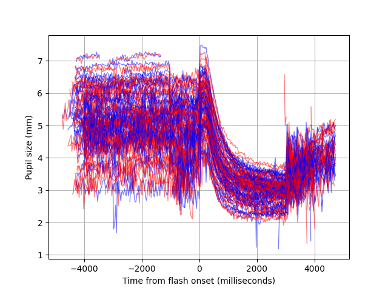

# BrainEye PLR home assignment - Mark Shovman
This assignment implements a code pipeline to analyze physiological eye-tracking data collected from users.

The dataset provided for this assignment contains a collection of pupillary light reflex (PLR) tests conducted by our app users. In each PLR test, the user looked into the phone camera while their eyes were recorded as the flash illuminated them for about three seconds, eliciting the pupillary light reflex.
Each test includes two files:
* Landmark file: This file contains the positions of 27 eye landmarks for each of the
user’s eyes, with each landmark representing a specific location on the eye, as specified
in the Landmark Definitions file (e.g., landmark 8 is the pupil center). This file has the
suffix “_landmarks.csv”
* Test protocol file: This file details the flash onset and offset times for the test. This file
has the suffix “_protocol.csv”

# Tasks and Notes
1. Clean Landmarks Data
   * Remove frames where the retCode is not OK.
   * My Notes:
     * I decided to set the landmark data to NaNs instead, for cleaner noise reduction and visualisation.
     * Also, calculated dataloss, logging a warning if it's high, and skipping a recording if it's very high   
2. Extract Pupil Size
   * Use pupil landmarks to extract the size of the pupil over time for each eye. Bonus: Convert the extracted pupil size signal from pixels to millimeters. Hint: The iris
   diameter has low variance across the population and can be assumed to be 11.7 mm.
   * My Notes:
     * I used a mean of four available diameters for pupil, and just the horizontal diameter for iris. 
     * A better approach might be to use weighted mean, giving higher weight to more robust diameters (horizontal, then diagonals), but that requires better understanding of the data.
     * From the following plot (all the recordings, both eyes: left-blue, right-red), I see that the data is overall clean, pupil size is within physiological limits (2-8 mm), and there is a clear pattern of PLR after the flash.
     * There is also something happening 1 second before the flash (count down? instructions?)
     * The sharp increase of pupil size just after flash onset, and again just after flash offset, seems strange - it is not physiological, so probably an artefact of the illumination change in the image processing. Arguably a bug.    
   

3. Signal Quality
   * Come up with a metric to represent the signal quality for a single test and explain your
   reasoning and observation.
   * My Notes:
     * Most of the noise I see is high-frequency frame-to-frame, which is typical for camera-based trackers that analyse each video frame on its own.
     * I assume that one second before the flash is a stable fixation, and the user is trying not to blink during that time, so it can be used to extract a measure of signal stability. 
     * Another relatively stable portion is between second 1 and 2 after the flash, and it is also more relevant to the biomarkers we want to derive.
     * For a stable fixation, the pupil size should remain relatively constant, so any changes can be considered noise.
     * I can think of three simple options for assessing signal instability: range, standard deviation, and, specifically for frame-to-frame pixel noise, RMS-S2S. It is often used in eyetracking data quality reporting, so I am going with it. 
4. Noise Reduction
   * Reduce noise in the pupil size signal using any method you consider suitable. Describe the technique you chose and explain your reasoning.
   * My Notes:
     * A simple, fast, and effective way to deal with frame-to-frame noise is to average over a small rolling window, 3 to 5 samples. 
     * I used a Tukey (tapered cosine) window of length 5, which is likely overkill, but a bit cleaner than just a flat window.
     * Both parameters (window size and type) are in the config file, so easy to experiment with.
     * That improved signal quality by 0.162 mm on average. 
5. Noise Reduction Figure
   * Create a figure showing pupil size over time, both before and after noise reduction.
   Include the pupil size signal quality measure developed in Stage 2 in the figure’s title,
   showing the measure for both the raw and noise-reduced signals. Did the noise
   reduction you applied affect the measure as expected?
6. Blink Detection and Removal
   * Detect and remove blinks from the data. Hint: Start by creating a signal indicating how
   open the eye is, then examine it to identify blink segments and choose a method for
   removing them. Keep in mind that not all tests will contain blinks.
   * My Notes:
     * I define blink as a period where either the eye openness (relative to max eye openness for this test) is lower than some threshold, 
     or the speed of change of eye openness is higher than some threshold
     * Eye openness is calculated from five pairs of landmarks, each normalized relative to its own max (not min) and then averaged.
     * Speed is calculated with a II-order Savitsky-Golay filter.
     * Landmark data during blinks is set to NaN separately for each eye
     * Blink detection and removal happen right after loading the landmarks, to reduce noise in the next steps - only the `is_blink` flag is kept.
7. Calculate Biomarkers for Each Eye
   * Constriction Latency: The reaction time of the pupil to the light (in ms).
   * Total Constriction: The amount of pupil constriction from the constriction onset to the point of maximum constriction (in pixels or mm).
   * Constriction Velocity: The speed of constriction (in pixels/sec or mm/sec).
   * Note: To calculate these features, first determine the “start of constriction”.
   * My Notes:
     * Calculated velocity in the same way as for eye openness, but with a wider window for a smoother signal
     * Also calculated maximum pupil constriction velocity, another widely used signal
8. Pupil Size and Constriction Figure
    * Create a figure showing pupil size over time, the period the light was on, the point you identified as the “start of constriction”, and the point of maximum constriction.
   

# Files
* `plr_pipeline.py` - main analysis pipeline
* `plr.py` - functions for loading and processind PLR data
* `plr_plot.py` - functions for plotting PLR data
* `landmark_definitions.json` - converted from `Landmark Definitions.pdf` using Claude
* `config.json` - various configurable parameters
* `figures\` - directory with the generated figures
* `reports\` - directory with generated reports:
  * `pipeline_summary.csv` - for each test (including those skipped because of high dataloss) log dataloss and signal quality
  * `biomarkers.csv` - for each test and each eye, log biomarkers